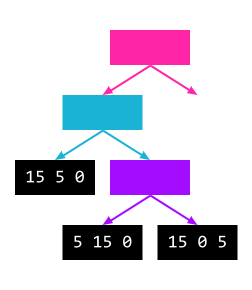

# tree-drawer

Generate images to demonstrate tree construction and manipulation.

Sample of the tree description:

```
@after-each-node frame
@after-last-child next-value frame
@node-size 80 35
a '' '15 5 0'
    b '' '15 5 0'
        end '15 5 0'
        c '' '15 0 5'
            end '5 15 0'
            end '15 0 5'
    end '10 5 5'
```

Some frames of the result:

Frame 5


Frame 6


Frame 10

